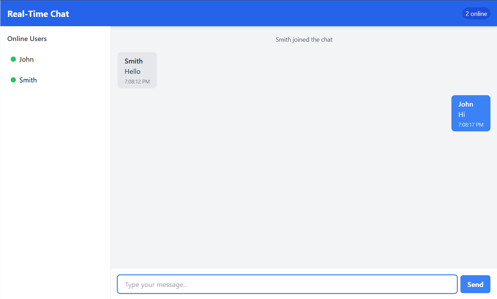

# Real-Time Chat Application

 *(Note: You would add an actual screenshot here)*

A modern, responsive real-time chat application built with Node.js, Express, Socket.io, and Tailwind CSS. This application allows users to:
- Join with a unique username
- Send and receive messages in real-time
- See who's online
- View message history

## Features

- **Real-time messaging** using WebSockets (Socket.io)
- **User authentication** with unique usernames
- **Online users list** that updates dynamically
- **Responsive design** that works on mobile and desktop
- **Message history** (last 50 messages stored in memory)
- **Modern UI** with Tailwind CSS
- **Mobile-friendly** interface with slide-out users panel

## Technologies Used

- **Backend**: Node.js, Express, Socket.io
- **Frontend**: HTML5, JavaScript, Tailwind CSS
- **Development Tools**: npm, Git

## Installation

### Prerequisites

- Node.js (v14 or higher)
- npm (comes with Node.js)

### Setup

1. Clone the repository:
   ```bash
   git clone https://github.com/azfarsuhail/real-time-messaging-app.git
   cd real-time-messaging-app
   ```

2. Install dependencies:
   ```bash
   npm install
   ```

3. Start the development server:
   ```bash
   npm start
   ```

4. Open your browser and navigate to:
   ```
   http://localhost:3000
   ```

## Usage

1. **Join the chat**:
   - Enter a unique username in the login modal
   - Click "Join Chat"

2. **Send messages**:
   - Type your message in the input field
   - Press Enter or click the Send button

3. **View online users**:
   - Desktop: Users list is always visible in the sidebar
   - Mobile: Tap the users icon in the bottom-right corner

## Connecting from Other Devices

### Local Network:
1. Find your computer's local IP address
2. On another device, navigate to `http://<your-ip>:3000`

### Internet Access (temporary):
1. Install ngrok (`npm install -g ngrok`)
2. Run `ngrok http 3000`
3. Use the provided ngrok URL on any device

## Project Structure

```
real-time-chat/
├── server.js            # Backend server
├── package.json         # Project dependencies
├── public/              # Frontend files
│   ├── index.html       # Main HTML file
│   ├── script.js        # Client-side JavaScript
│   ├── style.css        # Additional styles
│   └── tailwind.config.js # Tailwind configuration
```

## Future Improvements

- [ ] Add persistent message storage with a database
- [ ] Implement private/direct messaging
- [ ] Add typing indicators
- [ ] Support for emojis and file attachments
- [ ] User authentication with passwords
- [ ] Dark mode support

## Contributing

Contributions are welcome! Please fork the repository and submit a pull request.

## License

This project is licensed under the MIT License - see the [LICENSE](LICENSE) file for details.

## Acknowledgments

- Socket.io for real-time communication
- Tailwind CSS for utility-first styling
- Express.js for the backend framework